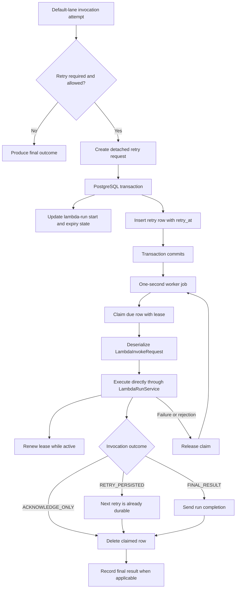

# Database-Backed Lambda Invocation Retries

## Purpose and scope

Default-lane lambda invocation retries are stored in the database and executed directly by a worker. A retry does not travel through Kafka before being invoked.

This mechanism applies only to retries of synchronous `InvocationLane.DEFAULT` executions. The surrounding flows remain unchanged:

- Fresh lambda invocation requests can still arrive through `lambda-invoke-request`.
- `InvocationLane.ASYNC` uses asynchronous Lambda invocation and its existing response path.
- A final default-lane outcome still publishes `lambda-run-completion` so normal run sequencing can continue.

The `lambda_invoke_retry_outbox` table is named as an outbox because the retry is inserted atomically with the lambda-run state transition. Operationally, it acts as a durable scheduled work queue consumed by the worker module itself.

## High-level flow



## 1. Deciding to retry

`DefaultLaneLambdaInvocationAttempt` coordinates a synchronous invocation and its start/expiry checks. A new retry can be requested when, for example:

- The Lambda call fails with a retryable client error.
- The lambda did not start before the start timeout.

The request is retried only while `LambdaInvokeRequest.canRetry()` is true. The default maximum is controlled by:

```text
vf.lambda.retries.max = 5
```

The effective maximum is also capped by the range supported by the invocation token.

The retry is created with `LambdaInvokeRequest.createRetryAttempt()`. This method creates a detached copy rather than mutating the request belonging to the previous attempt. It then:

1. Increments `retryAttempted`.
2. Increments `invocationGen`.
3. Replaces the `invocationToken` in the lambda input with a token derived from the run ID and the new invocation generation.

The detached request matters because the previous Lambda invocation can complete late. Its mutable result fields must not be able to overwrite the request for the next attempt.

## 2. Persisting the retry atomically

`LambdaRunStateServiceImpl.updateLambdaRunRetry()` executes in a `REQUIRES_NEW` database transaction.

It first locks the current lambda-run state and verifies that:

- The stored run ID is still the run being retried.
- The run has not already completed or been replaced by another run.
- The pending-run count does not exceed the configured retry limit.

When retrying is still valid, the transaction computes:

```text
retry_at   = current time + vf.lambda.retries.delay
expiryDate = retry_at + invocation timeout
```

The default retry delay is three seconds:

```text
vf.lambda.retries.delay = 3 seconds
```

The same transaction performs both operations:

1. Updates the lambda-run state for the new `invocationGen` and expiry time.
2. Inserts the serialized retry request into `lambda_invoke_retry_outbox`.

This is the central durability guarantee. If the transaction commits, the updated lambda-run state and its retry work both exist. If it rolls back, neither change is visible. There is no database-commit-then-Kafka-send failure window.

An existence check makes retry persistence idempotent for the same attempt identity. The database primary key provides the final uniqueness constraint.

## 3. Retry table

The logical schema is:

| Column | Purpose |
|---|---|
| `lambda_assignment_id` | Identifies the lambda assignment. |
| `lane` | Invocation lane; persisted retries currently use `DEFAULT`. |
| `run_id` | Identifies the logical lambda run. |
| `invocation_gen` | Identifies the individual invocation generation within the run. |
| `payload` | Serialized `LambdaInvokeRequest`. |
| `retry_at` | Earliest time at which the attempt may be claimed. |
| `claim_id` | UUID identifying the worker claim that currently owns the row. |
| `claim_until` | Lease expiry time for the current claim. |

The primary key is:

```text
(lambda_assignment_id, lane, run_id, invocation_gen)
```

This allows several attempts for one run while preventing duplicate storage of the same attempt.

The due-work index starts with `retry_at` and `claim_until`, supporting the polling query:

```text
(retry_at, claim_until, lambda_assignment_id)
```

PostgreSQL stores the payload as `bytea`; the canonical DDL and deployment migration define the table.

## 4. Polling schedule

`DispatchLambdaInvokeRetriesJob` is a static worker cron job with this expression:

```text
* * * * * ?
```

It runs approximately once per second and calls `LambdaInvokeRetryOutboxDispatcher.dispatchDueRetries()`.

Each firing submits at most this many attempts:

```text
vf.lambda.retries.outbox.dispatchBatchSize = 100
```

The dispatcher stops earlier when there are no eligible rows. If the local invocation executor is full, it releases the rejected claim and stops the current batch; the next cron firing tries again.

## 5. Claiming due work

Each call to `claimNextDue()` uses its own short `REQUIRES_NEW` transaction. It selects one row with:

```sql
SELECT ...
FROM lambda_invoke_retry_outbox
WHERE retry_at <= :now
  AND (claim_until IS NULL OR claim_until <= :now)
ORDER BY retry_at, lambda_assignment_id, lane, run_id, invocation_gen
LIMIT 1
FOR UPDATE SKIP LOCKED
```

The predicates mean that a row is eligible only when:

- Its scheduled retry time has arrived; and
- It is unclaimed or its previous lease has expired.

`FOR UPDATE` protects the selected row while the claim is assigned. `SKIP LOCKED` allows several worker processes to claim different rows concurrently instead of waiting behind the oldest locked row.

While holding the row lock, the service assigns:

```text
claim_id    = random UUID
claim_until = now + claim lease
```

The default lease is:

```text
vf.lambda.retries.outbox.claimLease = 2 minutes
```

The claim transaction then commits and releases the physical row lock. The worker does not hold a database transaction open while Lambda is running. Ownership is represented by the persisted `claim_id` and `claim_until` values.

## 6. Direct execution and backpressure

After claiming a row, `LambdaInvokeRetryOutboxDispatcher`:

1. Deserializes `payload` into `LambdaInvokeRequest`.
2. Starts lease renewal.
3. Calls `LambdaRunService.executeDefaultLaneLambdaRequest()` directly.
4. Registers asynchronous completion handling.

No Kafka producer or consumer participates in this retry handoff.

`LambdaRunService` uses a fixed-size request executor backed by a `SynchronousQueue`. The default capacity is:

```text
vf.lambda.invoke.requestThreads = 100
```

Because the queue has no storage capacity, submission is rejected immediately when all request threads are busy. The retry dispatcher responds by releasing that database claim and ending the current dispatch batch. This makes the existing invocation executor the local backpressure boundary.

Across worker processes, the database claim query distributes due retries. Within a process, the bounded request executor limits concurrent Lambda calls.

## 7. Lease renewal

A two-minute lease may be shorter than a complete Lambda attempt, so the dispatcher renews the lease while the invocation remains active.

Renewal is scheduled at half of the configured lease duration, with a minimum scheduling interval of 100 milliseconds. With the default lease, renewal runs once per minute.

Each renewal uses a separate transaction and is fenced by `claim_id`:

```sql
UPDATE lambda_invoke_retry_outbox
SET claim_until = :newClaimUntil
WHERE lambda_assignment_id = :lambdaAssignmentId
  AND lane = :lane
  AND run_id = :runId
  AND invocation_gen = :invocationGen
  AND claim_id = :claimId
```

The `claim_id` condition prevents a stale worker from extending a lease after another worker has reclaimed the row. Renewal stops when the invocation future completes.

If a worker process crashes, renewal stops automatically. Once `claim_until` passes, another worker can claim the row.

## 8. Processing invocation outcomes

The Kafka listener used for fresh requests and the database retry dispatcher share `LambdaRunService.processDefaultLaneInvocationOutcome()`. This keeps terminal behavior consistent regardless of how an attempt reached `LambdaRunService`.

### `ACKNOWLEDGE_ONLY`

The attempt needs no additional result processing. Examples include a duplicate request or a run that has already completed.

For a database retry, acknowledgment means deleting the claimed row.

### `RETRY_PERSISTED`

The failed attempt created another detached retry, and `updateLambdaRunRetry()` already committed the next retry row together with the new lambda-run state.

The dispatcher can therefore delete the row for the completed attempt. The new attempt has a different `invocation_gen` and remains scheduled by its own `retry_at` value.

### `FINAL_RESULT`

Final processing occurs in this order:

1. Publish `lambda-run-completion` for normal run sequencing.
2. Acknowledge the source; for a database retry, delete the claimed row.
3. Record/log the final invocation result.

This ordering matches the existing Kafka-listener behavior.

## 9. Completing and releasing claims

Successful acknowledgment deletes the row with the primary-key fields plus `claim_id`:

```sql
DELETE FROM lambda_invoke_retry_outbox
WHERE lambda_assignment_id = :lambdaAssignmentId
  AND lane = :lane
  AND run_id = :runId
  AND invocation_gen = :invocationGen
  AND claim_id = :claimId
```

The claim ID is a fencing token. If the lease expired and another worker obtained a new claim, the old worker's delete affects zero rows and cannot remove the new owner's work.

When submission or execution fails, the dispatcher releases the claim:

```sql
UPDATE lambda_invoke_retry_outbox
SET claim_id = NULL,
    claim_until = NULL
WHERE ...
  AND claim_id = :claimId
```

An explicitly released row is eligible on the next polling cycle because its `retry_at` is already in the past. The system does not wait for the original two-minute lease after a handled failure.

## 10. Failure and recovery behavior

| Failure point | Result |
|---|---|
| Transaction fails while updating run state or inserting retry | Both operations roll back; no inconsistent retry is exposed. |
| Worker crashes before claiming | Row remains unclaimed and another worker can claim it. |
| Worker crashes after claim but before invocation | Row becomes eligible after the lease expires. |
| Local executor rejects submission | Claim is released immediately; current batch stops. |
| Invocation coordination completes exceptionally | Claim is released immediately and the failure is logged. |
| Worker crashes during Lambda invocation | Renewal stops; another worker may retry after lease expiry. The original Lambda may still complete, so duplicate execution is possible. |
| Lease expires and another worker reclaims the row | The old `claim_id` cannot renew, release, or delete the new claim. |
| Next retry is persisted, then worker crashes before deleting the previous row | Both attempt rows may temporarily exist. Run/invocation identity checks make the old attempt stale or duplicate when recovered. |
| Final completion is sent, then worker crashes before deleting the row | Recovery can repeat final processing; downstream completion handling must tolerate duplicates. |

## 11. Delivery semantics

The mechanism provides at-least-once attempt execution, not exactly-once execution.

It deliberately favors a possible duplicate over a lost retry. Exactly-once execution cannot be guaranteed across the database, worker process, Lambda, and completion messaging without a much broader distributed transaction or idempotency protocol.

Duplicate effects are limited by existing invocation identity:

- `run_id` identifies the logical run.
- `invocation_gen` identifies the invocation generation.
- `invocationToken` is regenerated for each attempt and allows the lambda start path to recognize duplicate/stale starts.
- Lambda-run state checks reject attempts for completed or superseded runs.
- `claim_id` fences database ownership operations.

The retry payload itself is durable, but application-level lambda logic should still be idempotent where external side effects are possible.

## 12. Assignment cleanup

When lambda-assignment run data is deleted, `LambdaRunDaoImpl.deleteLambdaAssignmentRunData()` deletes all retry rows for that assignment before deleting the remaining run data. This prevents retries from executing after their owning assignment data has been removed.

## 13. Configuration summary

| Property | Default | Meaning |
|---|---:|---|
| `vf.lambda.retries.max` | `5` | Maximum retry count, additionally capped by invocation-token capacity. |
| `vf.lambda.retries.delay` | `3 seconds` | Delay before a newly persisted retry becomes eligible. |
| `vf.lambda.retries.maxPendingRuns` | `5` | Pending-run multiplier used to reject retry creation under excessive backlog. |
| `vf.lambda.retries.outbox.dispatchBatchSize` | `100` | Maximum attempts submitted by one cron firing. |
| `vf.lambda.retries.outbox.claimLease` | `2 minutes` | Claim duration; renewed halfway through while execution is active. |
| `vf.lambda.invoke.requestThreads` | `100` | Per-worker maximum concurrent default-lane invocation tasks. |

## 14. Deployment requirement

The table must exist before workers containing this implementation are started. The canonical
PostgreSQL DDL contains the final table definition for newly built databases. Existing deployments
must receive an equivalent reviewed migration before this code is deployed; checking in a migration
does not apply it automatically.

## 15. Main implementation classes

- `DefaultLaneLambdaInvocationAttempt` decides whether another retry is needed.
- `LambdaRunStateServiceImpl` atomically updates run state and persists retry work.
- `LambdaInvokeRetryOutboxServiceImpl` claims, renews, completes, and releases rows in short transactions.
- `LambdaInvokeRetryOutboxMapper.xml` contains the locking and fencing SQL.
- `DispatchLambdaInvokeRetriesJob` polls once per second.
- `LambdaInvokeRetryOutboxDispatcher` executes claimed retries directly and manages leases.
- `LambdaRunService` owns invocation concurrency and shared outcome processing.
